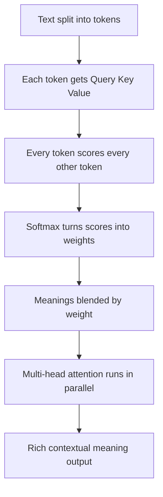

## 🤔 What Is It?

> **attention is all you need**

"Attention Is All You Need" is a famous research paper that taught AI to understand language by letting every word in a sentence instantly check how important every other word is to its own meaning — all at the same time, instead of reading left to right like a slow reader.

## 🧩 Like highlighting a paragraph with your whole study group at once

Imagine your study group is trying to understand a confusing paragraph in a history book. Instead of reading it word by word from left to right, everyone grabs a highlighter and — all at the same time — each word scores every other word: "How much do you help explain me?" The word "castle" lights up "medieval," "king," and "siege" with bright yellow, but barely touches "the" or "a." The word "king" does the same thing, lighting up its own most helpful neighbors. Every word does this simultaneously, creating a glowing web that shows exactly which words explain which other words — and that web of highlights is what the paper calls attention.

## ⚙️ How It Works

1. **Chop text into tokens** — The AI splits the sentence into small pieces called tokens — usually one word each, sometimes just part of a word. Think of cutting the paragraph into individual sticky notes, one per word.
2. **Each token gets three roles** — Every token creates three things — a Query ("what am I looking for?"), a Key ("what topic am I about?"), and a Value ("what information do I carry?"). Each sticky note writes three secret labels on its back before the highlighting begins.
3. **Every token scores every other token** — Each token's Query is compared against every other token's Key to produce a score — like each word asking every other word, "On a scale of 1 to 10, how helpful are you to me right now?" This is self-attention: the whole group rating itself at once.
4. **Scores become highlight weights** — A math step called softmax converts those raw scores into percentages that all add up to 100%, so the AI knows exactly how brightly to highlight each neighbor — high score means a vivid highlight, low score means nearly invisible.
5. **Blend meanings and repeat with fresh highlighters** — Each token's final meaning is a weighted blend of every other token's Values — like mixing ink in proportion to highlight brightness. Running this whole process several times in parallel with different "highlighter colors" is called multi-head attention, letting the model spot grammar, topic, and tone all at once.

## 🗺️ Picture It

## 🔑 Key Words

- **token** — a single word or word-chunk the AI reads — the basic sticky-note unit of text
- **self-attention** — the step where every token in a sentence compares itself to every other token in that same sentence, all at the same time
- **query, key, value** — three pieces every token creates: the question it asks others (query), the label it shows to others (key), and the information it shares when highlighted (value)
- **softmax** — a math step that turns raw comparison scores into percentages all adding up to 100%, keeping the highlight weights sensible
- **multi-head attention** — running the full highlighting process several times in parallel, each pass looking for a different kind of relationship between words
- **transformer** — the overall AI architecture introduced by the paper — built entirely on attention, with no need to read words one at a time

## 🌍 Why It Matters

Before this paper, AI read sentences like a tired reader who forgets the beginning of a sentence by the time they reach the end. The transformer let AI see the whole sentence at once and understand tangled relationships that older systems missed entirely. Almost every powerful AI tool you use today — chatbots, translators, voice assistants — is built directly on this one idea.

## 🔍 Where You'll See This

- ChatGPT answering your questions uses a transformer that pays attention to every word you typed at once
- Google Translate figures out whether 'bank' means a riverbank or a money bank by using attention to check surrounding words
- Spotify's AI reads song descriptions and uses similar attention ideas to understand the mood of a track

## ✅ Check Yourself

**Q1.** The AI breaks the sentence 'I love pizza' into three ____ before it can start reading them.

- token
- softmax
- transformer

Show answer

<strong>token</strong> — A token is the basic word-chunk unit the AI works with; softmax is a math step and transformer is the full architecture — neither describes a piece of text.

**Q2.** When the word 'bank' needs to figure out whether it means a river or money, it uses ____ to compare itself with every surrounding word all at once.

- multi-head attention
- self-attention
- query, key, value

Show answer

<strong>self-attention</strong> — Self-attention is specifically when every token compares itself to every other token in the same sentence simultaneously; multi-head attention is running that whole process several times in parallel.

**Q3.** The ____ step takes raw scores like 8.2, 0.4, and 3.1 and converts them into percentages that all add up to 100%.

- softmax
- self-attention
- transformer

Show answer

<strong>softmax</strong> — Softmax is the math function that normalizes scores into a tidy probability distribution; self-attention produces the raw scores and transformer is the larger architecture.

**Q4.** Running the highlighting process five times at once — each time looking for a different kind of word relationship — is called ____.

- token
- multi-head attention
- self-attention

Show answer

<strong>multi-head attention</strong> — Multi-head attention means running several attention passes in parallel with different learned lenses; self-attention is just one pass, and a token is a unit of text.

**Q5.** The paper showed you can build a powerful AI language model using only a ____, completely replacing the older approach of reading words one at a time.

- query, key, value
- transformer
- token

Show answer

<strong>transformer</strong> — A transformer is the architecture built entirely on attention; query, key, value are the internal pieces each token creates, and a token is just one word-chunk of input.

## 🎉 Fun Fact

> The title 'Attention Is All You Need' was a playful nod to the Beatles song 'All You Need Is Love' — the eight Google researchers thought it was a fun joke title, never guessing their paper would become one of the most cited scientific papers in history and spark the AI explosion happening right now.
