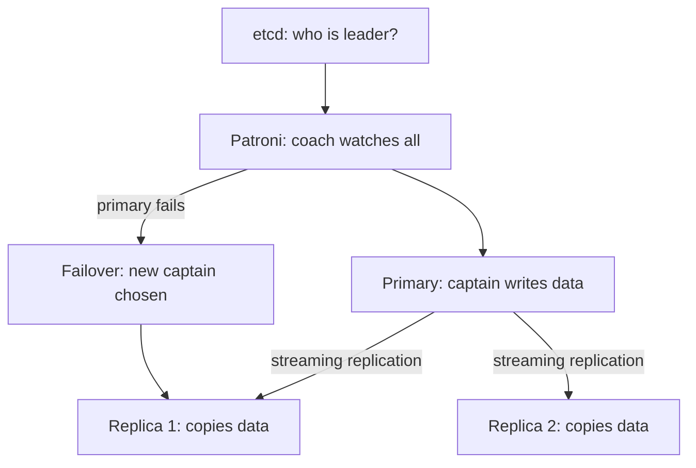

## 🤔 What Is It?

> **Patroni 기반 분산 PostgreSQL, Patroni HA**

Patroni is smart coach software that watches over a team of database servers — if the main server breaks, it instantly picks a backup to take over so your app never goes offline.

## 🧩 Like a soccer team with an automatic coach

Imagine a soccer team where one player is chosen as the captain — they call all the plays and everyone follows them. Three other players are backup captains who watch every single move the main captain makes and copy every strategy note into their own notebooks, second by second. A super-smart coach named Patroni watches everyone from the sideline, and the whole team shares one giant whiteboard called etcd that always shows exactly who the current captain is. If the main captain suddenly twists their ankle and can't play, Patroni instantly checks the backups, picks the one whose notebook is most up-to-date, writes the new name on the whiteboard, and the game keeps going — all in a few seconds. Nobody in the stands even notices the switch happened.

## ⚙️ How It Works

1. **Set up the team** — Multiple PostgreSQL database servers start up together as a cluster — one becomes the Primary (the captain who handles all writes) and the rest become Replicas (backup captains), with Patroni running on every single one.
2. **Backup captains copy every move** — Through streaming replication, every time the Primary saves a new piece of data it immediately streams a copy to all Replica servers — exactly like the backup captains copying the captain's notebook in real time.
3. **Coach registers everyone on the whiteboard** — Patroni has each server check in with etcd, the shared whiteboard. The Primary claims a special 'leader lock' entry on the whiteboard so every server in the cluster always knows who is in charge.
4. **Coach spots the captain is down** — Patroni constantly pings the Primary to check it is healthy. If the Primary stops responding — like a captain carried off the field — the leader lock on etcd disappears and Patroni sees it within seconds.
5. **New captain steps up automatically** — Patroni triggers a failover: it picks the Replica whose notebook is most current, promotes it to Primary, and writes the new leader's name on the etcd whiteboard — the game never stops.

## 🗺️ Picture It

## 🔑 Key Words

- **Primary node** — The main PostgreSQL server that accepts all new data writes — the team captain
- **Replica node** — A backup server that continuously copies data from the Primary and stands ready to take over at any moment
- **Patroni** — Open-source coach software that monitors all nodes and manages automatic leader switches
- **Failover** — The automatic switch from a broken Primary to a healthy Replica so the service keeps running without anyone noticing
- **Streaming replication** — The continuous process of sending every new data change from the Primary to all Replicas in real time
- **etcd** — A shared coordination service — like a whiteboard — that all servers use to agree on who the current leader is

## 🌍 Why It Matters

Every app you use — from online games to streaming services — stores its data in a database, and if that one server crashes, the whole app goes dark. Patroni-based PostgreSQL means a spare server takes over in seconds with no data loss, keeping apps online around the clock. This is why banks, hospitals, and social networks — places where even one minute of downtime is a crisis — depend on it.

## 🔍 Where You'll See This

- Netflix staying online even if one of its database servers crashes mid-movie
- Your bank's app letting you check your balance at 3 AM without any outage
- An online multiplayer game keeping your progress safe during a server hardware failure
- Hospital systems accessing patient records instantly, with no downtime allowed

## ✅ Check Yourself

**Q1.** The ____ is the main PostgreSQL server that accepts all new data writes.

- Primary node
- Replica node
- Patroni

Show answer

<strong>Primary node</strong> — The Primary node is the captain who handles all writes; Replica nodes only copy data, and Patroni is the coach software, not a server role.

**Q2.** When the main server goes down, a ____ kicks in automatically so a backup takes over.

- Failover
- Streaming replication
- etcd

Show answer

<strong>Failover</strong> — Failover is the specific switch-over event; streaming replication is about copying data continuously, and etcd is the coordination store, not the switch itself.

**Q3.** Backup servers stay perfectly in sync through ____, copying every new change from the leader.

- Streaming replication
- Primary node
- Failover

Show answer

<strong>Streaming replication</strong> — Streaming replication is the continuous data-copy pipeline; a Primary node is a server role, not a process; failover is a one-time switch event.

**Q4.** All Patroni-managed servers check ____ to agree on who the current leader is.

- etcd
- Replica node
- Failover

Show answer

<strong>etcd</strong> — etcd is the shared whiteboard all nodes use to coordinate leadership; a Replica node is a server type, and failover is an event, not a coordination store.

**Q5.** The smart coach software that monitors PostgreSQL health and triggers leader switches is called ____.

- Patroni
- etcd
- Streaming replication

Show answer

<strong>Patroni</strong> — Patroni is the orchestration tool that watches nodes and manages elections; etcd just stores who the leader is, and streaming replication is a data-copy process.

## 🎉 Fun Fact

> Patroni was originally built by engineers at Zalando, a giant European online fashion store, because they needed their database to survive server crashes during massive sales events — with literally zero minutes of downtime allowed.
