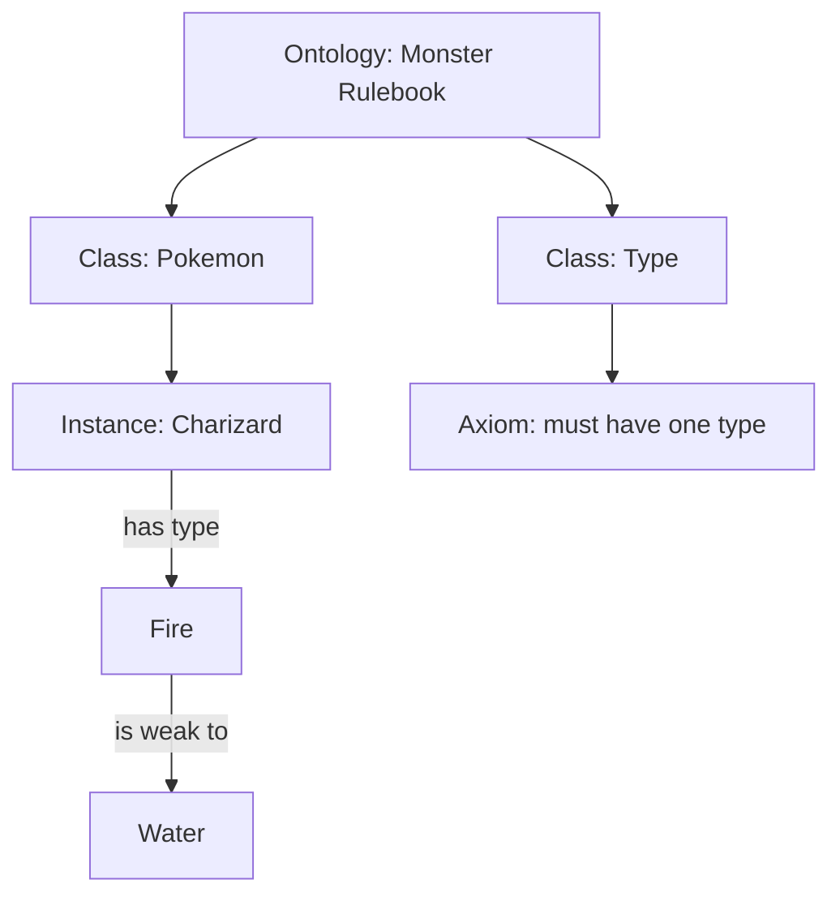

## 🤔 What Is It?

> **ontology**

An ontology is an official rulebook that tells a computer what kinds of things exist in a topic, what facts describe each one, and how they all connect to each other — so the computer can actually reason about meaning, not just match words.

## 🧩 Like writing the master Pokédex rulebook from scratch

Imagine you are building a Pokémon game from zero and must write a master rulebook so the game engine understands its whole world. First the rulebook names the categories that exist — 'Pokémon', 'Type', and 'Move' are real things here. Then it says what facts describe each category — every Pokémon has a name, a weight, and HP. Next it plugs in real individuals — Charizard and Squirtle are actual entries in the Pokémon category. After that it draws connections — Charizard HAS-TYPE Fire, and Fire IS-WEAK-TO Water. Finally it sets hard rules — 'every Pokémon must belong to at least one type.' Once the game engine reads that rulebook, it can answer questions you never directly programmed in, like 'which Pokémon lose to a Water attack?'

## ⚙️ How It Works

1. **Name the categories (Classes)** — You list every kind of thing that exists in your topic — in the Pokédex rulebook, that means officially declaring 'Pokémon', 'Type', and 'Move' as named categories called classes.
2. **Describe each category (Attributes)** — You say what facts belong to each class — a Pokémon has a name, a weight, and HP, just like every monster entry in the Pokédex has its own stat box.
3. **Add real examples (Instances)** — You plug in actual individual things — Charizard and Squirtle are instances, real members of the Pokémon class, the way each monster card is a specific entry in the Pokédex.
4. **Draw the connections (Relationships)** — You define how classes and instances link to each other — Charizard HAS-TYPE Fire, Fire IS-WEAK-TO Water — giving the computer a map of connections, like arrows drawn between entries.
5. **Set the hard rules (Axioms)** — You write strict logical rules — 'every Pokémon must have at least one type' is an axiom, a rule the computer trusts completely and uses to check and extend its own reasoning.

## 🗺️ Picture It

## 🔑 Key Words

- **ontology** — a formal rulebook that defines what kinds of things exist, their properties, and how they relate
- **class** — a named category of things in the rulebook, like 'Pokémon' or 'Type'
- **instance** — one real individual that belongs to a class, like Charizard being one specific Pokémon
- **attribute** — a property or fact that describes a class, like HP or weight for a Pokémon
- **relationship** — a named link between two things in the rulebook, like HAS-TYPE or IS-WEAK-TO
- **axiom** — a strict rule the computer treats as always true and uses to reason about new questions

## 🌍 Why It Matters

Ontologies are the hidden backbone of AI assistants, search engines, and medical databases — they let computers understand that 'heart attack' and 'myocardial infarction' mean the same thing, or that searching 'jaguar' in a car context should not return jungle cats. Without an ontology a computer only matches letters; with one it can actually reason about what things mean and how they relate.

## 🔍 Where You'll See This

- Google's info box beside search results uses an ontology to know Taylor Swift IS a person, IS an artist, and HAS albums — not just a string of text
- Siri and Alexa use ontologies so they know a 'movie' has a 'director' and a 'cast', letting them correctly answer 'who directed Moana?'
- Hospital software uses medical ontologies so doctors can search any name for a disease and find the same records, no matter which term was typed

## ✅ Check Yourself

**Q1.** In the Pokédex rulebook, 'Pokémon' and 'Type' are examples of a ____, because they are named categories of things.

- instance
- class
- axiom

Show answer

<strong>class</strong> — A class is a named category; 'Pokémon' and 'Type' label whole groups of things, while an instance is one individual member and an axiom is a rule.

**Q2.** Charizard is an ____ of the Pokémon class, because it is one specific real member of that category.

- axiom
- attribute
- instance

Show answer

<strong>instance</strong> — An instance is a single real individual belonging to a class; Charizard is one specific Pokémon, not a rule or a describing property.

**Q3.** The rule 'every Pokémon must have at least one type' is an ____, a strict logical statement the computer always trusts.

- axiom
- relationship
- attribute

Show answer

<strong>axiom</strong> — An axiom is a hard rule treated as always true; a relationship links two things together, and an attribute describes a property like HP or weight.

**Q4.** HAS-TYPE and IS-WEAK-TO are examples of a ____, because they are named links connecting two things in the rulebook.

- class
- attribute
- relationship

Show answer

<strong>relationship</strong> — A relationship is a named connection between two things; a class is a category, and an attribute is a describing property of a category.

**Q5.** HP and weight are ____ of the Pokémon class, because they are facts that describe every member of that category.

- attribute
- instance
- ontology

Show answer

<strong>attribute</strong> — An attribute is a property that describes a class; HP and weight tell you facts about Pokémon rather than naming an individual or the whole rulebook.

## 🎉 Fun Fact

> The word 'ontology' was borrowed from ancient philosophy, where it meant 'the study of what exists in reality' — computer scientists in the 1990s liked the term so much they grabbed it for their digital rulebooks, and some philosophers were genuinely annoyed.
