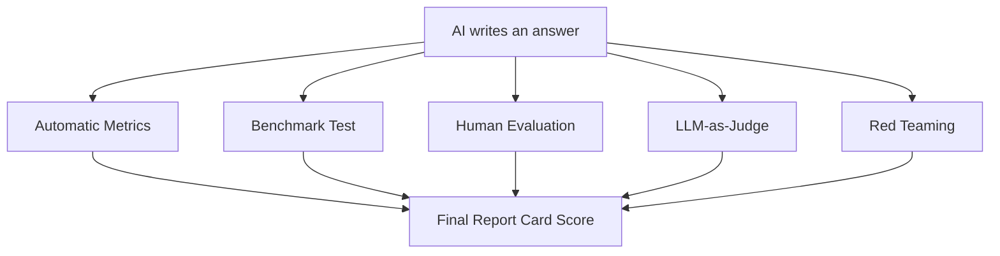

## 🤔 What Is It?

> **11 LLM Evaluation Methods**

Just like teachers use tests, essays, pop quizzes, and group projects to figure out how much a student really knows, scientists use 11 different grading methods to measure how good an AI chatbot truly is — because a single score would miss way too much.

## 🧩 Like a school report card with 11 different grades

Imagine your school gave you 11 different grades instead of just one final mark. Some grades come from fill-in-the-blank tests a computer scores in seconds. Some come from your teacher carefully reading your essay. Some come from a big nationwide standardized test so every school can compare students fairly. Some come from a classmate peer-grading your project. And some come from a sneaky surprise quiz designed to catch you if you make things up when you don't actually know the answer. AI scientists do exactly the same thing with chatbots — they run the AI through all 11 kinds of 'report card' checks, because a chatbot that aces one test might completely fail another.

## ⚙️ How It Works

1. **Decide what skills matter** — First, researchers write the rubric — they list the skills the AI must have, like writing clearly, answering factual questions correctly, and staying safe. This is exactly like a teacher deciding what will be on the report card before any grading begins.
2. **Run automatic metrics** — Fast computer programs compare the AI's answers to known correct answers and produce a number score in milliseconds. Methods like the BLEU score count how many words the AI's answer shares with the ideal answer — the same way a machine can instantly grade a matching worksheet.
3. **Give it a benchmark test** — Researchers make every AI take the same giant standardized test — like MMLU, a massive quiz covering math, science, law, and history — so different AIs can be ranked on equal footing, just like a nationwide exam lets you compare students from different schools.
4. **Have real humans judge the answers** — Real people read the AI's responses and rate them for quality, helpfulness, and accuracy. This is human evaluation — like a teacher grading an open-ended essay where a computer's word-counting tricks just aren't good enough to capture real quality.
5. **Let another AI be the judge** — A second, more powerful AI reads the first AI's answers and scores them — this is called LLM-as-judge, and it works like peer grading in class: faster than waiting for a teacher, but researchers still watch carefully to make sure the AI-grader isn't just being nice to its classmate.
6. **Try to trick it with red teaming** — Finally, safety testers deliberately try to make the AI say something wrong, harmful, or completely made-up — like a teacher who hides trick questions in a test to catch students who are bluffing instead of truly understanding. Any weaknesses found here get fixed before the AI goes public.

## 🗺️ Picture It

## 🔑 Key Words

- **LLM** — Large Language Model — an AI trained on enormous amounts of text to read and write like a human; ChatGPT and Gemini are examples
- **automatic metrics** — Computer programs that score AI answers instantly by comparing them to correct answers using math, no human needed
- **BLEU score** — A specific automatic metric that measures how many words in the AI's answer overlap with the expected correct answer
- **benchmark** — A standardized test that every AI takes so their abilities can be compared fairly — like a nationwide exam for chatbots
- **human evaluation** — Real people reading and rating the AI's answers for quality and correctness, the way a teacher grades an essay
- **LLM-as-judge** — Using a second, powerful AI to grade another AI's answers — like peer grading, but done by a classmate who is also an AI
- **red teaming** — Deliberately trying to trick or break the AI with sneaky or harmful questions to find its weak spots before the public uses it

## 🌍 Why It Matters

No single test can show whether an AI is truly smart, safe, and honest — just like one quiz can't show everything a student knows. Using 11 different evaluation methods helps researchers catch hidden weaknesses before millions of people rely on the AI for homework help, medical questions, or important decisions. It's also how we catch AIs that sound confident but quietly make things up, which could be dangerous in the real world.

## 🔍 Where You'll See This

- ChatGPT, Gemini, and other chatbots are ranked on public leaderboards using benchmark tests like MMLU — every score you see on those leaderboards came from these evaluation methods
- Before a new AI assistant gets added to a homework-help app, human raters check hundreds of its answers to make sure none of them are wrong or unsafe
- Safety teams at AI companies use red teaming to find out if their chatbot can be tricked into giving harmful advice, then fix the problem before anyone outside the company sees it

## ✅ Check Yourself

**Q1.** When every AI chatbot takes the same giant science-and-history quiz so their scores can be compared fairly, researchers call that a ____.

- benchmark
- red teaming
- human evaluation

Show answer

<strong>benchmark</strong> — A benchmark is a standardized test for equal comparison — red teaming tries to trick the AI, and human evaluation has people grading essays, not running a uniform quiz.

**Q2.** A computer program that instantly measures how many words in the AI's answer match the correct answer is an example of ____.

- LLM-as-judge
- automatic metrics
- red teaming

Show answer

<strong>automatic metrics</strong> — Automatic metrics are math-based programs that score answers in milliseconds; LLM-as-judge uses another AI, and red teaming is about adversarial trick questions.

**Q3.** When a safety team deliberately asks an AI sneaky, harmful, or confusing questions to find dangerous weaknesses, that process is called ____.

- BLEU score
- human evaluation
- red teaming

Show answer

<strong>red teaming</strong> — Red teaming means adversarially attacking the AI like a teacher's trick questions — BLEU score is a word-overlap metric and human evaluation is people rating quality.

**Q4.** A second, powerful AI reading and scoring another AI's answers is known as ____.

- LLM-as-judge
- benchmark
- BLEU score

Show answer

<strong>LLM-as-judge</strong> — LLM-as-judge means one AI acts as the grader for another — like peer grading; benchmarks are standardized tests and BLEU score counts word matches.

**Q5.** ChatGPT, Gemini, and other text-based AI assistants are all examples of a ____.

- red teaming
- LLM
- automatic metrics

Show answer

<strong>LLM</strong> — LLM stands for Large Language Model — the category these chatbots belong to; red teaming is a testing process and automatic metrics are scoring programs.

## 🎉 Fun Fact

> The benchmark test called MMLU has over 15,000 questions across 57 subjects — from elementary math to professional law — and was specifically designed so that an AI can't ace it just by memorizing; it has to actually understand the material.
