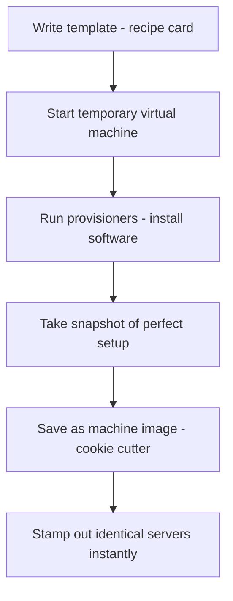

## 🤔 What Is It?

> **hashicorp packer**

Packer is a tool that automatically builds a perfect, ready-to-copy computer setup — like a cookie cutter — so you can stamp out hundreds of identical servers in seconds instead of setting each one up by hand.

## 🧩 Like designing one perfect cookie cutter, then stamping out thousands of identical cookies

Imagine you need to bake 500 identical star-shaped cookies for a giant school bake sale. You could cut each cookie by hand with a knife — painfully slow and never quite the same — or you could design one perfect star-shaped cookie cutter, press it into dough, and get a perfect star every single time. Packer is the machine that designs and stamps out your cookie cutter. You write a recipe card that says exactly what shape the cutter should be and what ingredients go in. Packer then sets up a pop-up kitchen, carefully crafts the perfect cutter, and hands it to you. Whenever you need a new cookie — a new server — you just press the cutter in: no measuring, no guessing, just instant perfect copies every time.

## ⚙️ How It Works

1. **Write the template (recipe card)** — You write a text file that tells Packer exactly which software to install, which settings to apply, and which platforms to target — like writing down the exact shape and size of cookie cutter you want made.
2. **Start a temporary virtual machine (pop-up kitchen)** — Packer fires up a temporary pretend computer inside a real computer — a pop-up kitchen used just for this one build session, which gets torn down cleanly afterwards.
3. **Run provisioners (add ingredients and shape the dough)** — Scripts called provisioners run inside that temporary computer, installing software and adjusting settings — like a chef measuring and mixing every ingredient in exactly the right order.
4. **Take a snapshot and save the machine image (cast the cookie cutter)** — Once everything is perfect, Packer takes a snapshot — an instant photo of the entire computer state — and saves it as a machine image: your finished, reusable cookie cutter, ready to use forever.
5. **Stamp out identical servers (press the cutter into dough)** — Any time you need a new server, the cloud just presses that cookie cutter into fresh dough — spinning up a brand-new server from the image in seconds, perfectly identical to every other one.

## 🗺️ Picture It

## 🔑 Key Words

- **template** — A text file — your recipe card — that tells Packer what software to install and which platforms to build the image for
- **machine image** — A saved, ready-to-copy snapshot of a fully set-up computer — the reusable cookie cutter — that can be cloned to launch identical servers instantly
- **provisioner** — A script or tool that runs inside the temporary computer during the build to install software and change settings
- **virtual machine** — A pretend computer that runs entirely inside a real computer's memory — the pop-up kitchen Packer uses while building, then throws away
- **builder** — The part of Packer that creates a machine image for one specific platform, such as AWS, VMware, or Docker
- **snapshot** — An instant photograph of a computer's entire state — operating system, software, and settings — frozen at one perfect moment

## 🌍 Why It Matters

Without Packer, every new server has to be set up by hand — a slow, error-prone process where one missed step can break an entire app. Packer lets companies build one trusted image and roll out hundreds of identical servers in minutes, which keeps services like Netflix and Spotify running smoothly even when millions of people log on at the same time. Security patches can also be baked right into the image, so every new server is safe from the moment it starts.

## 🔍 Where You'll See This

- Netflix uses Packer to pre-build server images so new video-streaming servers spin up in seconds when a huge crowd logs on for a new season drop
- A game studio builds a Packer image with their multiplayer game server software already loaded, then stamps out hundreds of identical servers on launch day
- A school IT team uses Packer to create one perfect laptop setup image and rolls it out to every computer in the building without touching each machine individually

## ✅ Check Yourself

**Q1.** Packer reads a ____ to know which software to install and which platforms to build for.

- snapshot
- template
- provisioner

Show answer

<strong>template</strong> — A template is the recipe card listing all instructions; a snapshot is the finished photo of the computer taken at the end, and a provisioner is a script that runs during the build — neither tells Packer what to build.

**Q2.** The saved, ready-to-copy computer setup that Packer produces at the end is called a ____.

- machine image
- virtual machine
- builder

Show answer

<strong>machine image</strong> — A machine image is the finished cookie cutter you reuse; a virtual machine is the temporary kitchen Packer used while building it, and a builder is just the tool that created it — not the finished product.

**Q3.** A ____ runs scripts inside the temporary computer to install and configure software during the build.

- snapshot
- builder
- provisioner

Show answer

<strong>provisioner</strong> — A provisioner is the chef mixing the ingredients; a snapshot is taken after everything is done, and a builder sets up the environment — but neither one actually installs the software step by step.

**Q4.** Packer starts a ____ — a pretend computer inside a real computer — so it has a clean, throwaway workspace.

- virtual machine
- template
- machine image

Show answer

<strong>virtual machine</strong> — A virtual machine is the pop-up kitchen that runs inside real hardware and disappears when the build is done; a template is the recipe card, and a machine image is the finished cookie cutter — neither is a running computer.

## 🎉 Fun Fact

> Packer was the very first tool HashiCorp ever released — back in 2013 — and it was written in just a few weeks by the company's founder as a side experiment that accidentally turned into a product used by companies all over the world!
