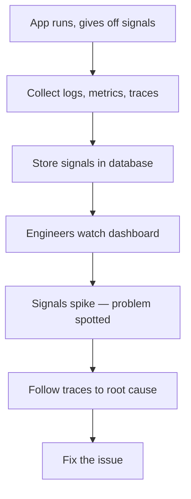

## 🤔 What Is It?

> **observability**

Observability is the ability to understand what's going on inside a running app just by reading the signals it gives off — like watching a game's health bar, mini-map, and chat log all at once so you can spot problems fast.

## 🧩 Like your game's health bar, mini-map, and chat log

Imagine you're playing a big online game. While you play, three things are always visible: a health bar showing a number that rises and falls, a mini-map tracking every place your character has been, and a chat log recording every event — 'You entered the cave at 4:02 PM,' 'Enemy spawned.' Now picture the game's developers looking at the same kind of display, but for their computers instead of your character. They can see how hard each server is working, a record of every event that happened, and the exact path your click took through dozens of machines. If the game suddenly lags or crashes, the developers don't have to guess — they read those signals and follow the clues, the same way you'd replay a tough boss fight frame by frame to figure out exactly where things went sideways.

## ⚙️ How It Works

1. **App gives off signals constantly** — While the software runs, it automatically produces three kinds of signals: logs (a time-stamped record of events), metrics (numbers like speed or error count), and traces (the path one request took through the system). Think of these as the chat log, health bar, and mini-map your game already shows you.
2. **Tools collect all the signals** — Special software gathers every log line, every metric reading, and every trace as they happen — the way a game server silently records every move every player makes, so nothing is missed.
3. **Signals are stored safely** — All those collected signals are saved in a database so engineers can look back in time, just like a recorded game replay that lets you scrub back to exactly the moment the boss fight went wrong.
4. **Engineers watch a dashboard** — The stored signals appear on a dashboard — a screen packed with live charts and numbers — so engineers can watch the app in real time, the same way a coach stares at a scoreboard to catch the moment a player's performance drops.
5. **Trace the problem to its root** — When something breaks, engineers follow the traces to see exactly which computer or step in the chain caused the trouble — like following your character's footprints on the mini-map back to the exact tile where the ambush happened.

## 🗺️ Picture It

## 🔑 Key Words

- **logs** — A time-stamped list of events the app recorded, like a chat log that says 'user logged in at 3:02 PM'
- **metrics** — Numbers that measure the app's health over time — things like speed, error count, or how many users are online right now
- **traces** — A step-by-step record of the path one single request took through the system, showing every computer it passed through
- **dashboard** — A screen that pulls all the signals (logs, metrics, traces) together into charts so engineers can see the whole system at a glance
- **observability** — The ability to understand what's happening inside a running system purely by reading the signals it gives off, without having to stop or open it up

## 🌍 Why It Matters

Modern apps can run across hundreds of computers at the same time, so when something breaks it's nearly impossible to find the bug by guessing. Observability gives engineers the tools to pinpoint problems in seconds — sometimes before users even notice anything is wrong. Without it, a tiny hidden bug could take down a game, a bank app, or an online store for hours.

## 🔍 Where You'll See This

- Netflix engineers use observability to figure out why a video buffers for one specific user but loads fine for everyone else
- Fortnite's servers use metrics and logs to catch lag spikes before millions of players notice the game slowing down
- When Instagram won't load, observability tools help engineers find the exact failed server within seconds

## ✅ Check Yourself

**Q1.** When the game server records 'Player123 bought a sword at 4:15 PM,' that line is saved in the system's ____.

- logs
- metrics
- traces

Show answer

<strong>logs</strong> — Logs are time-stamped records of events — exactly like that line. Metrics are changing numbers, and traces follow a request's path.

**Q2.** The chart showing how many players are online right now is a ____, because it's a number that changes every second.

- dashboard
- metrics
- logs

Show answer

<strong>metrics</strong> — Metrics are the changing measurements of a system's health. A dashboard displays them, and logs record text events — they don't measure quantities over time.

**Q3.** To find out which server slowed down your login, engineers follow the request's ____ from your phone all the way to the database.

- traces
- logs
- metrics

Show answer

<strong>traces</strong> — Traces show the step-by-step path a request takes through the system. Logs record individual events and metrics measure numbers, but neither maps the full journey.

**Q4.** All the live charts, error counts, and graphs are collected in one ____ so the whole team can see the system at a glance.

- dashboard
- traces
- observability

Show answer

<strong>dashboard</strong> — A dashboard is the viewing screen that brings all the signals together. Traces are path records, and observability is the broader concept — neither is the screen itself.

**Q5.** ____ is what gives engineers the power to understand a broken app without ever stopping it or guessing.

- observability
- logs
- metrics

Show answer

<strong>observability</strong> — Observability is the overall ability to understand a system from its signals. Logs and metrics are individual signal types that contribute to it, but neither word names the full concept.

## 🎉 Fun Fact

> The word 'observability' was borrowed from aerospace engineering — NASA used it in the 1960s to describe how well ground control could understand a spacecraft's condition purely from the radio signals it beamed back to Earth.
