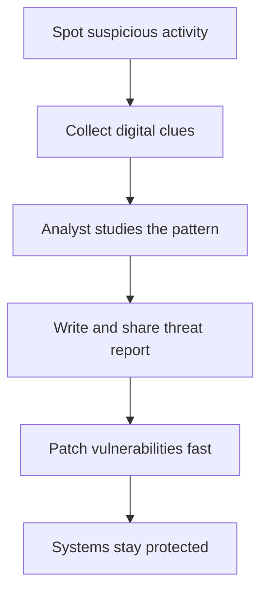

## 🤔 What Is It?

> **Cyber Threat Intelligence)**

Cyber Threat Intelligence is when security experts collect and share clues about hackers — who they are, how they attack, and what they want — so everyone can defend themselves before an attack even happens.

## 🧩 Like a neighborhood watch sharing burglary clues

Imagine your street has been having break-ins. One neighbor notices muddy boot prints near their window, another spots a suspicious van parked outside, and a third sees their doorknob had been jiggled. They all share these clues at a neighborhood meeting and figure out it's a crew that targets houses with broken porch lights on Tuesday nights. Now every neighbor knows to fix their porch light and double-lock the back door before Tuesday — and when the crew shows up, they find nothing easy to break into. Cyber Threat Intelligence works exactly like this: the neighborhood is the internet, the break-in crew is hackers, and the clues are digital footprints left behind in computer systems.

## ⚙️ How It Works

1. **Spot suspicious activity** — Security software watches computer systems around the clock, just like neighbors keeping an eye on the street. When something looks odd — a strange login at 3 a.m. or a file behaving weirdly — it gets flagged as a potential clue.
2. **Collect all the evidence** — Security teams gather every digital clue they can find, called Indicators of Compromise. These are like the muddy boot prints and jiggled doorknobs — small signs that a hacker has been poking around.
3. **Analyst studies the pattern** — A security expert called an analyst studies all the clues together to figure out who the threat actor is and exactly how they attack. This is like the neighborhood putting all the sightings on a map to see the full pattern.
4. **Write and share threat report** — The findings get packaged into a threat report and shared with other organizations, just like the neighborhood watch sends an alert to the whole street. Now everyone knows what to look for before the next attack.
5. **Patch vulnerabilities fast** — Armed with the intelligence, teams fix every vulnerability — every weakness a hacker could squeeze through — before the attack arrives. It's like every neighbor finally fixing their broken porch light before Tuesday night.

## 🗺️ Picture It

## 🔑 Key Words

- **Cyber Threat Intelligence** — Collected, analyzed knowledge about hackers used to defend systems before an attack strikes
- **Indicators of Compromise** — Digital clues — like strange logins or unusual files — that reveal a hacker has been in a system
- **Threat actor** — The hacker or criminal group carrying out an attack
- **Analyst** — A security expert who studies attack clues and turns them into useful warnings for defenders
- **Vulnerability** — A weakness in a computer system that a hacker can exploit to break in
- **Threat report** — A written summary of who is attacking, how they do it, and how to stop them — shared across organizations

## 🌍 Why It Matters

Every day, hackers try to break into banks, hospitals, schools, and gaming platforms — and no single organization can spot every new trick on its own. Cyber Threat Intelligence lets defenders share warnings the way firefighters share information about wildfires, so one team's hard-earned lesson protects everyone else. Without it, every organization would have to figure out each new attack from scratch, giving hackers a huge head start.

## 🔍 Where You'll See This

- Google Safe Browsing warns Chrome and Firefox users away from dangerous websites using threat intelligence gathered from billions of browsing reports worldwide.
- When a hospital's security team discovers a new ransomware attack, it shares the warning with other hospitals so they can block the same attack before it reaches them.
- Your school's internet filter blocks harmful websites partly because threat intelligence from thousands of schools and companies is pooled and shared automatically.

## ✅ Check Yourself

**Q1.** Security teams collect digital clues called ____ to spot signs that a hacker may have visited a system.

- Indicators of Compromise
- Threat actor
- Vulnerability

Show answer

<strong>Indicators of Compromise</strong> — Indicators of Compromise are the specific digital clues that reveal a hacker's presence; a threat actor is the attacker, and a vulnerability is a weakness — neither is a clue.

**Q2.** The hacker or criminal group behind an attack is known as a ____.

- Threat actor
- Analyst
- Threat report

Show answer

<strong>Threat actor</strong> — Threat actor names the attacker; an analyst is the defender studying the clues, and a threat report is the document they write — both are on the defender's side.

**Q3.** A weakness in a computer system that a hacker can sneak through is called a ____.

- Vulnerability
- Indicators of Compromise
- Analyst

Show answer

<strong>Vulnerability</strong> — Vulnerability means a weak spot in a system; indicators of compromise are clues left after poking around, and an analyst is the human expert — not a weakness.

**Q4.** The security expert who studies attack patterns and turns clues into useful warnings is called an ____.

- Analyst
- Cyber Threat Intelligence
- Threat actor

Show answer

<strong>Analyst</strong> — An analyst is the human doing the detective work; cyber threat intelligence is the knowledge they produce, and a threat actor is the attacker they're studying.

**Q5.** Teams package and share their findings in a ____ so other organizations know who is attacking and how to stop them.

- Threat report
- Vulnerability
- Indicators of Compromise

Show answer

<strong>Threat report</strong> — A threat report is the packaged document shared across organizations; a vulnerability is a weakness, and indicators of compromise are raw clues — neither is a finished, shareable report.

## 🎉 Fun Fact

> Some cyber threat intelligence analysts go 'undercover' on dark web hacker forums — reading criminals' own private chats — to discover planned attacks before they happen, just like a detective listening in at a villain's secret meeting.
