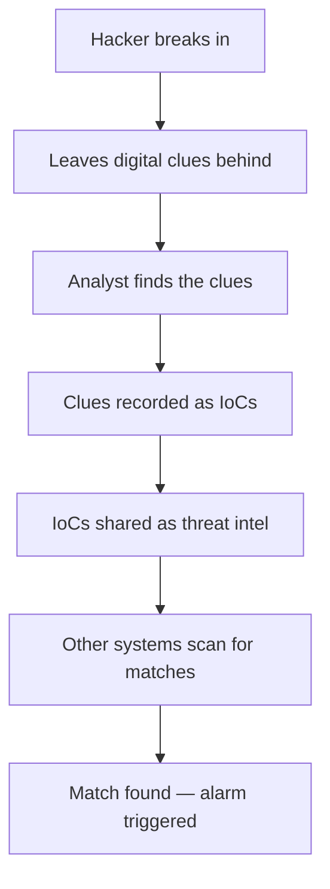

## 🤔 What Is It?

> **IoC(Indicator of Compromise)**

An Indicator of Compromise (IoC) is a digital clue — like a suspicious file or an unusual connection — that tells security experts a computer may have been attacked. By collecting and sharing these clues, security teams can spot the same hackers targeting other systems too.

## 🧩 Like a detective's crime-scene clue book

Imagine a burglar breaks into a house and gets away, but they leave clues behind — a muddy boot print near the back door, a greasy fingerprint on the window, and scratch marks on the lock. A detective arrives, photographs every clue, and records them all in an evidence book. Then that detective shares the book with every police station in the country, so if those same boot prints or fingerprints turn up at another crime scene, officers instantly know: it's the same burglar. IoCs work exactly the same way — except the crime scene is a hacked computer, the clues are things like suspicious files or unusual connections, and the detectives are security analysts sharing their evidence book with the whole world.

## ⚙️ How It Works

1. **The break-in happens** — A hacker sneaks into a computer system, just like a burglar slipping through an unlocked window. The system has been compromised — something private is now under the attacker's control.
2. **Clues are left behind** — Every attack leaves traces: a malware file the hacker secretly installed, a suspicious computer address that connected without permission, or an odd program that ran at midnight — these are the digital equivalent of muddy boot prints.
3. **Analysts identify the clues** — A security analyst — the digital detective — examines the system and picks out every suspicious trace. Each trace is labeled and recorded as an official IoC, like photographing fingerprints and logging them in an evidence book.
4. **IoCs shared as threat intelligence** — The recorded IoCs are added to shared threat intelligence databases, so other organizations' security tools can see them — just like sending fingerprint records to every police station in the country.
5. **Other systems scan for a match** — Security software everywhere automatically checks incoming files, connections, and programs against the known IoCs. If a match is found, an alarm goes off — the same burglar has tried to strike again, and this time security was waiting.

## 🗺️ Picture It

## 🔑 Key Words

- **IoC (Indicator of Compromise)** — A digital clue left behind by an attack — like a suspicious file or unusual connection — that signals a computer may have been hacked
- **compromise** — When a hacker successfully breaks into or takes control of a computer system without permission
- **security analyst** — A cybersecurity expert who investigates hacked systems, identifies IoCs, and helps stop future attacks
- **threat intelligence** — Shared knowledge about cyberattacks — including collections of IoCs — passed between organizations so everyone can defend against the same threats
- **file hash** — A unique digital fingerprint calculated from a file's contents; if a file's hash matches a known bad file, it becomes an IoC
- **malware** — Malicious software — programs secretly created by hackers to damage, spy on, or take control of computers

## 🌍 Why It Matters

Without IoCs, every hacker attack would have to be discovered from scratch, giving attackers time to hit dozens of victims before anyone caught on. By sharing IoCs, one organization's hard lesson becomes everyone's shield — if one company discovers a new attack, the whole world can block it within hours. This teamwork approach is one of the main reasons cybersecurity teams are able to keep up with thousands of new threats every single day.

## 🔍 Where You'll See This

- Your school's antivirus software blocks a download because its file hash matches a known IoC from a recent cyberattack
- A gaming platform like Roblox notices logins coming from a suspicious computer address — an IoC warning that player accounts may have been stolen
- A hospital's security team shares suspicious website addresses from a scam email campaign so other hospitals can automatically block them

## ✅ Check Yourself

**Q1.** A muddy boot print at a crime scene is like a ____ — a digital clue that experts use to figure out if a computer has been hacked.

- IoC (Indicator of Compromise)
- file hash
- malware

Show answer

<strong>IoC (Indicator of Compromise)</strong> — An IoC is the digital clue left by an attack; a file hash is one specific type of IoC, and malware is the attacker's tool — not the clue itself.

**Q2.** When a hacker secretly takes control of a computer system, that system has suffered a ____.

- compromise
- threat intelligence
- file hash

Show answer

<strong>compromise</strong> — Compromise means a system has been broken into and taken over; threat intelligence is shared attack knowledge, and a file hash is a digital fingerprint — neither describes the break-in event.

**Q3.** Security teams share ____ — organized knowledge about attacks — so that all organizations can defend against the same threats.

- malware
- threat intelligence
- IoC (Indicator of Compromise)

Show answer

<strong>threat intelligence</strong> — Threat intelligence is the shared collection of attack knowledge; malware is malicious software, and an IoC is one piece of evidence that gets included in threat intelligence — not the whole shared system.

**Q4.** A ____ is like a unique fingerprint of a file that lets security software instantly recognize a dangerous program.

- security analyst
- file hash
- compromise

Show answer

<strong>file hash</strong> — A file hash is the unique digital fingerprint of a file's contents; a security analyst is the person doing the detective work, and a compromise is a break-in event — neither is a fingerprint.

**Q5.** The digital detective who examines a hacked computer and turns suspicious traces into official IoCs is called a ____.

- malware
- file hash
- security analyst

Show answer

<strong>security analyst</strong> — A security analyst is the cybersecurity expert who does the investigative work; malware is an attacker's tool, and a file hash is a type of clue — not a person.

## 🎉 Fun Fact

> The world's largest IoC-sharing platform, VirusTotal, receives over one million suspicious files uploaded by users every single day — making it one of the busiest digital crime labs on the entire planet.
