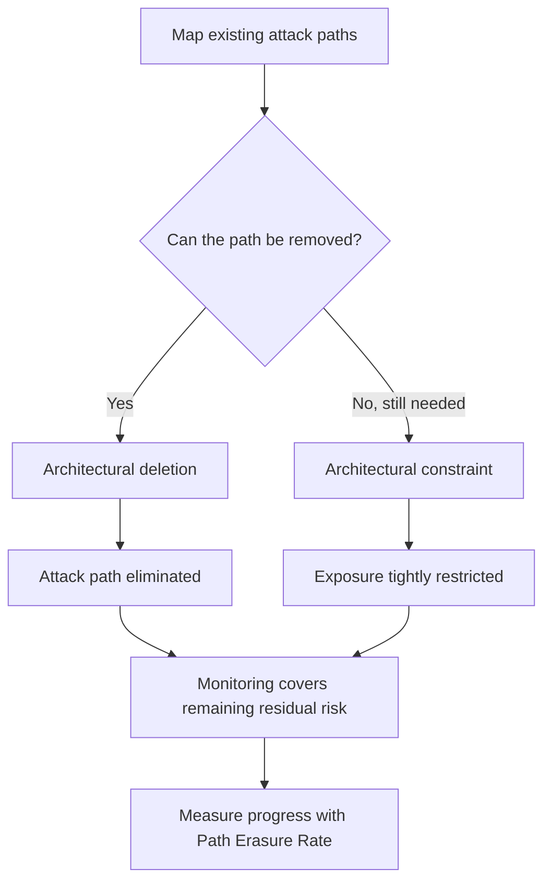

## 🤔 What Is It?

> OWASP subtractive security

Subtractive security means removing or restricting the actual paths an attacker could use — unused accounts, old protocols, excess privileges, unnecessary network exposure — instead of just adding more monitoring tools to watch for trouble. OWASP's new Subtractive Security Top 10 argues that deleting a risky path is more effective than merely detecting when someone uses it.

## 🧩 Like clearing an overgrown backyard instead of installing more cameras

Imagine a backyard with overgrown bushes hiding the fence line, a side gate that never locks, and a shed door that won't quite close. One option is to bolt on more security cameras and motion sensors so you get an alert every time someone sneaks through. That's useful, but the bushes, the broken gate, and the loose door are still there, waiting to be used. A smarter homeowner trims the bushes, fixes the lock, and repairs the door — removing the actual ways in, so there's far less left to watch for in the first place. That "fix the yard, not just the cameras" instinct is exactly what OWASP's subtractive security recommends for computer systems.

## ⚙️ How It Works

1. Map the existing paths — Security teams first list out accounts, services, trust relationships, privileges, protocols, and network exposure that attackers could potentially use, like walking the yard to spot every weak spot.
2. Architectural deletion — Wherever possible, remove the path entirely: delete dormant accounts, turn off legacy protocols, revoke unnecessary admin rights, shut down unused services — like tearing out the broken gate altogether.
3. Architectural constraint — When a path can't be fully removed because the business still needs it, tightly restrict it instead, using network segmentation, private endpoints, conditional access, or permission boundaries — like adding a stronger lock because you still need that gate.
4. Monitoring and detection come last — Logging, SIEM platforms, and alerts are still valuable, but OWASP places them as the final layer, for whatever risk remains after deletion and constraint — like keeping a camera on the one spot you couldn't fully secure.
5. Measure the improvement — OWASP introduces the Path Erasure Rate (PER), which tracks what share of known attack paths have actually been structurally eliminated, so teams can prove progress instead of just counting alerts.

## 🗺️ Picture It

## 🔑 Key Words

- OWASP — Open Worldwide Application Security Project — a nonprofit group of experts who publish free guides and warnings about how to keep software safe
- subtractive security — A strategy that reduces risk by deleting or restricting unnecessary access, services, and privileges rather than only adding monitoring on top of them
- architectural deletion — Permanently removing an unneeded account, service, protocol, or permission so the path simply no longer exists
- architectural constraint — Tightly limiting a path that can't be fully removed for business reasons, using segmentation or access restrictions
- Path Erasure Rate (PER) — A metric measuring what portion of known, eligible attack paths have actually been structurally eliminated
- attack surface — The full set of points where an unauthorized user could try to get into a system

## 🌍 Why It Matters

Piling on more alerts and dashboards doesn't remove the underlying exposure — the risky account, protocol, or permission is still sitting there waiting to be found. OWASP's Subtractive Security Top 10 pushes teams to delete or constrain those paths first, so entire categories of attack become impossible rather than just easier to notice after the fact.

## 🔍 Where You'll See This

- Turning off an old remote-access protocol nobody uses anymore, instead of just logging every login attempt against it
- Deleting a former employee's dormant account, instead of relying on alerts to flag suspicious activity from it
- Removing local admin rights from everyday user accounts, instead of only monitoring what admins do with them

## ✅ Check Yourself

Q1. In OWASP's Subtractive Security Top 10, removing a path entirely — like deleting a dormant account — is called ____.

- architectural constraint
- architectural deletion
- monitoring and detection

Show answer

<strong>architectural deletion</strong> — This means permanently removing the unnecessary path itself; architectural constraint is for paths that can't be removed, and monitoring only watches for activity on paths that still exist.

Q2. Which comes last in OWASP's recommended hierarchy of Delete, Constrain, Monitor?

- Architectural deletion
- Architectural constraint
- Monitoring and detection

Show answer

<strong>Monitoring and detection</strong> — OWASP treats logging and alerting as the last line of defense for whatever risk remains, not the first response to a risky path.

Q3. A backyard where the broken gate is fixed and the bushes are trimmed, rather than just adding more cameras, best represents ____.

- monitoring and detection
- subtractive security
- Path Erasure Rate

Show answer

<strong>subtractive security</strong> — Fixing the actual weak points removes the path an intruder could use, which is the core idea behind subtractive security.

Q4. What does the Path Erasure Rate (PER) measure?

- How many alerts a security team receives per day
- The share of known attack paths that have been structurally removed
- The number of employees trained on security policy

Show answer

<strong>The share of known attack paths that have been structurally removed</strong> — PER quantifies real structural progress, not activity like alert volume or training counts.

## 🎉 Fun Fact

> Widespread worms like Code Red and Nimda in 2001 spread largely because many Windows servers shipped with extra services enabled by default. It was a major reason Microsoft later built "attack surface reduction" into its security practices — trimming away unnecessary default features instead of just adding patches after the fact.
