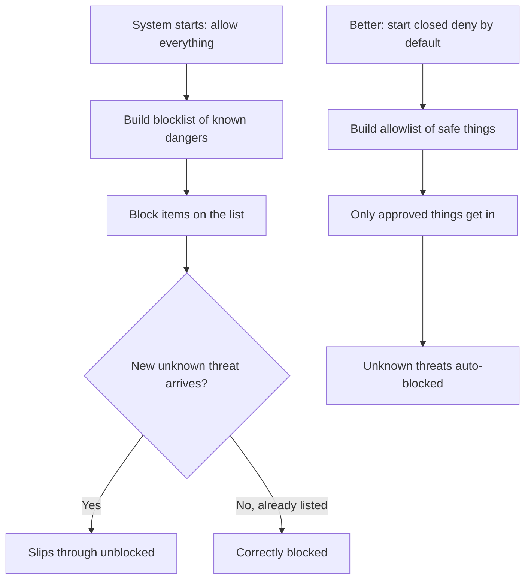

## 🤔 What Is It?

> **OWASP subtractive security**

Subtractive security means letting everything into a computer system by default and then trying to block the bad stuff — but security experts at OWASP warn this is risky because you can only block dangers you already know about, letting brand-new threats slip right through.

## 🧩 Like a school cafeteria piling everything onto your tray

Imagine the school cafeteria starts every lunch by dumping every single food they have onto your tray — pizza, mystery meat, spoiled milk, stuff you're allergic to, everything. Then a lunch monitor walks by and tries to remove the foods that could hurt you, working from yesterday's list of known bad foods. The problem is the monitor can only take off things already on that list. If a brand-new food showed up today that nobody knew was dangerous, it stays on your tray because no one knew to remove it yet. A much safer cafeteria would start with an empty tray and only add foods already proven safe for you. That 'start empty, only add safe things' approach is exactly what OWASP recommends instead of subtractive security.

## ⚙️ How It Works

1. **System starts: allow everything** — A system using subtractive security begins wide open — like a tray loaded with every food in the cafeteria. All requests and features are permitted by default from the very first moment.
2. **Build a blocklist of known dangers** — Security experts write down every bad thing they already know about, creating a blocklist — like the lunch monitor's written list of spoiled foods and known allergens to remove.
3. **Remove the listed dangers** — The system automatically rejects anything on the blocklist, just like the monitor sweeps flagged items off your tray before you sit down to eat.
4. **Unknown threats slip through unblocked** — If a new attack appears that nobody has seen before, it is not on the list, so the system lets it in untouched — exactly like a new allergen the monitor has never heard of stays right on your tray.
5. **OWASP recommends the opposite: additive security** — Instead of starting full and subtracting bad things, OWASP says start with an empty tray and use an allowlist — only adding things proven safe — so anything new and unknown is automatically blocked without needing to know about it first.

## 🗺️ Picture It

## 🔑 Key Words

- **OWASP** — Open Web Application Security Project — a nonprofit group of experts who publish free guides and warnings about how to keep software safe
- **subtractive security** — A strategy that allows everything by default and then tries to remove known dangerous things — like clearing a fully loaded tray rather than building a safe one from scratch
- **additive security** — A strategy that blocks everything by default and only permits things specifically approved as safe — the opposite of subtractive security
- **blocklist** — A list of things explicitly forbidden — the system blocks anything that appears on this list
- **allowlist** — A list of things explicitly permitted — the system only lets through what is on this list and blocks everything else
- **deny by default** — A security rule that says block everything unless it is specifically approved — the core idea powering additive security

## 🌍 Why It Matters

Most real-world security breaches happen because attackers invent a new trick the blocklist has never seen before — subtractive security is always playing catch-up. OWASP's guidelines push developers toward deny-by-default allowlisting instead, so even totally new attacks are blocked automatically without needing to update any list. Understanding this difference helps explain why well-built apps and websites are designed the careful, additive way.

## 🔍 Where You'll See This

- An email spam filter that only blocks senders on a known-bad list (subtractive) vs. one that only delivers mail from contacts you have approved (additive)
- A game's chat filter that tries to catch every bad word it knows about — but brand-new slang slips through until someone updates the list
- A school's website blocker that bans known bad sites but lets through any new site it has never catalogued before

## ✅ Check Yourself

**Q1.** Subtractive security relies on a ____ to stop attacks it already knows about, but struggles the moment a new attack appears.

- allowlist
- blocklist
- deny by default

Show answer

<strong>blocklist</strong> — A blocklist holds the known-bad things to remove; an allowlist and deny by default both describe the safer additive approach that starts closed instead of open.

**Q2.** OWASP recommends ____, where you start with nothing allowed and only open up what is proven safe.

- subtractive security
- additive security
- blocklist

Show answer

<strong>additive security</strong> — Additive security starts closed and only adds approved safe things; subtractive security starts open and tries to remove bad things, which is what OWASP warns against.

**Q3.** A cafeteria tray that starts completely empty and only gets foods already approved for you is a perfect example of ____.

- deny by default
- subtractive security
- blocklist

Show answer

<strong>deny by default</strong> — Deny by default means nothing is allowed until explicitly approved — exactly what the empty-tray-first approach represents; subtractive security is the full-tray approach.

**Q4.** When a security team creates an ____, only the items explicitly on that list are permitted into the system.

- OWASP
- allowlist
- subtractive security

Show answer

<strong>allowlist</strong> — An allowlist names exactly what is permitted and blocks everything else; OWASP is an organization, not a list, and subtractive security is a strategy, not a list.

## 🎉 Fun Fact

> The very first computer worm to cause massive internet damage — the Morris Worm in 1988 — spread partly because systems trusted network connections by default (pure subtractive thinking). It infected roughly 6,000 machines, which was about 10% of the entire internet at the time!
