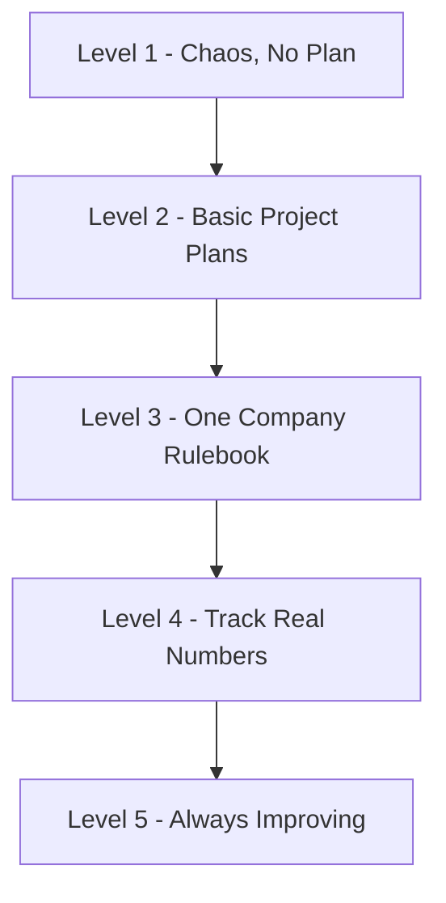

## 🤔 What Is It?

> **CMMi**

CMMi is a scoring system that measures how organized and consistent a software company's teamwork is — kind of like a report card that grades whether a team always follows its game plan or just wings it every time.

## 🧩 Like leveling up a soccer team from playground chaos to championship pros

Imagine a soccer team that starts out with zero plan — players just show up and do whatever they feel like, and every match is total chaos. Slowly, the coach starts writing a game plan for each match. Then the whole club agrees on one official training rulebook everyone must follow, every game, every practice. Next, the team starts recording every single stat — pass accuracy, shots on goal, sprint speed — so they can see exactly what's working with real numbers. Finally, the very best teams use all that data to constantly experiment and refine their tactics each season, always chasing perfection. CMMi works exactly like that rating system for soccer clubs — except it grades software companies instead of sports squads.

## ⚙️ How It Works

1. **Level 1 — Initial (Chaos)** — The team has no written game plan; every match is improvised and results are completely unpredictable. Software companies at this level fix bugs and build features differently every single time, depending on who happens to be around that day.
2. **Level 2 — Managed (Basic Plans)** — The coach now writes a game plan for each individual match, even if different games use different plans. Companies at this level start planning and tracking each project before work begins, so nothing is a total surprise.
3. **Level 3 — Defined (One Official Rulebook)** — The whole soccer club agrees on one standard training rulebook that every team in the club must follow, not just one coach's notes. Companies at this level have a single, documented process that every team across the whole organization must use for every project.
4. **Level 4 — Quantitatively Managed (Stats and Numbers)** — The team records every stat — pass accuracy, goals scored, defensive errors — so coaches can measure performance precisely with hard numbers. Companies at this level measure their processes with real data to catch problems early, before they grow into disasters.
5. **Level 5 — Optimizing (Always Improving)** — Using all those stats, the team constantly experiments and refines drills and tactics every season, never settling for last year's playbook. Companies at this top level treat improvement itself as a never-ending process, hunting for small gains all the time.

## 🗺️ Picture It

## 🔑 Key Words

- **CMMi** — Capability Maturity Model Integration — a five-level rating system that measures how organized and repeatable a company's work processes actually are
- **Maturity Level** — one of five stages (1 through 5) showing how advanced and consistent a company's way of working is — higher means more organized
- **Process** — a documented, repeatable set of steps for doing a specific job — like a recipe your whole team follows every single time
- **Appraisal** — an official inspection where trained outside reviewers check and confirm which CMMi level a company has genuinely reached
- **Best Practice** — a proven, tried-and-tested method that experts agree consistently produces the best results
- **Quantitatively Managed** — controlled using real numbers and measurements — not gut feelings or guesses — so you can see exactly what is and isn't working

## 🌍 Why It Matters

When hospitals, banks, or governments hire a software company to build something life-critical — like medicine tracking or air traffic control — they need solid proof that the team won't just wing it. A high CMMi rating is that proof, showing clients the company will deliver reliably, on time, and with far fewer dangerous bugs. Many defense and aerospace contracts actually require suppliers to hold CMMi Level 3 or higher by law before they can even bid for the work.

## 🔍 Where You'll See This

- NASA requires CMMi Level 3 from software teams that build mission-critical systems — like the code that helps land rovers safely on Mars
- Defense contractors writing software for military aircraft or satellites are often legally required to reach CMMi Level 3 or higher before they can even be hired
- When your school district buys new student-records software, the company selling it might advertise its CMMi rating as proof it won't accidentally lose your grades

## ✅ Check Yourself

**Q1.** A company that controls every step of its workflow using exact measurements and real data is described as ____.

- Maturity Level
- Quantitatively Managed
- Best Practice

Show answer

<strong>Quantitatively Managed</strong> — 'Quantitatively Managed' means controlled by real numbers — perfect fit here; 'Maturity Level' is the overall score, not a measurement method, and 'Best Practice' is a proven technique, not a way of measuring.

**Q2.** When every team in a company must follow the same documented steps for every project, they share a standard ____.

- Appraisal
- CMMi
- Process

Show answer

<strong>Process</strong> — A 'Process' is the repeatable set of steps — exactly what's shared here; an 'Appraisal' is the inspection event, and 'CMMi' is the whole rating framework, not a single set of steps.

**Q3.** Before a company receives its official CMMi score, trained outside reviewers must complete a formal ____.

- Appraisal
- Best Practice
- Maturity Level

Show answer

<strong>Appraisal</strong> — An 'Appraisal' is the official inspection that confirms which level was reached; 'Best Practice' is a technique, and 'Maturity Level' is the result of the appraisal, not the inspection itself.

**Q4.** A soccer team's tried-and-tested training drill that coaches everywhere agree always produces top results could be called a ____.

- Process
- Best Practice
- CMMi

Show answer

<strong>Best Practice</strong> — 'Best Practice' is a proven method experts agree consistently works best — that matches a universally praised drill; 'Process' is any repeatable steps (not specifically proven to be the best), and 'CMMi' is the whole rating system.

## 🎉 Fun Fact

> The original idea behind CMMi was invented at Carnegie Mellon University in 1991, funded by the US military — which was furious about spending billions of dollars on software projects that kept arriving years late, massively over budget, or completely broken!
