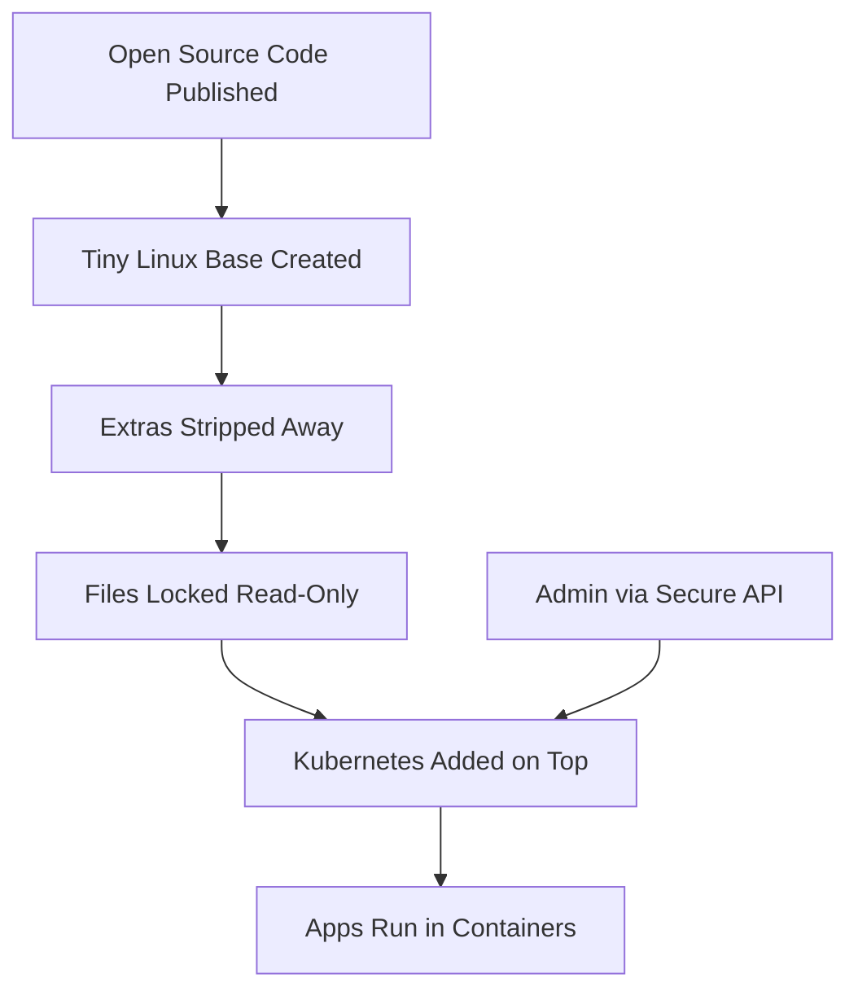

## 🤔 What Is It?

> **Talos is a modern OS for running Kubernetes: secure, immutable, and minimal. Talos is fully open source,**

Talos is a super-stripped-down operating system built to do one job: run Kubernetes, the software that keeps big apps alive in the cloud. It is sealed so tight that no one can accidentally (or sneakily) break it.

## 🧩 Like a Formula 1 Race Car vs. a Family SUV

A family SUV can carry groceries, seat seven people, play podcasts, and do a hundred everyday things. A Formula 1 race car does exactly one thing — win races — so every back seat, cup holder, and radio has been torn out to save weight and go faster. The engine casing is welded shut; mechanics can only work on it in the pit lane using official, approved tools. The car's blueprints are also published online so any racing team in the world can study and improve the design. Talos is the Formula 1 race car of computer operating systems: built for one job (running Kubernetes), stripped of everything unnecessary, locked so nothing can be changed mid-race, and with its blueprints shared publicly for anyone to use.

## ⚙️ How It Works

1. **Start with a tiny Linux base** — Talos begins with a bare-bones version of Linux — just the metal chassis of the race car, with nothing bolted on yet.
2. **Strip out everything non-essential** — Any tool, app, or service that is not needed to run Kubernetes is deleted entirely — like pulling out the back seats, air conditioning, and radio to shed weight.
3. **Lock the whole system read-only** — The remaining files are sealed so they cannot be edited while the system is running, just like a welded-shut engine casing — to update anything, you swap the whole sealed unit instead of tinkering mid-race.
4. **Place Kubernetes on top** — Kubernetes is loaded as the one powerful engine this stripped chassis was built to carry, ready to organize and run all your apps.
5. **Control everything through the secure API** — Admins send instructions through one official, encrypted communication channel called the API — like mechanics using an approved pit-lane radio — because there is no shell or login prompt to type commands into directly.

## 🗺️ Picture It

## 🔑 Key Words

- **OS** — Operating System — the master software on a computer that lets all other programs run, like the rulebook that tells a school how to function.
- **Kubernetes** — Software that organizes and keeps track of many running apps spread across lots of computers, like a pit-crew chief coordinating an entire racing team.
- **Immutable** — Cannot be changed once set — like a race car's sealed engine casing that you can only replace, never tinker with while the race is on.
- **Minimal** — Contains only the absolute bare essentials — like a race car with no cup holders or radio, nothing that does not help it go fast.
- **Open source** — The code (the full set of instructions) is public and free for anyone to read, use, or improve — like publishing the race car blueprints online.
- **API** — A secure, official channel that lets one computer program send instructions to another — like the approved radio frequency mechanics use to talk to the driver.

## 🌍 Why It Matters

When companies run huge services — streaming video, hospital records, online banking — they need servers that are almost impossible to hack or accidentally misconfigure. Talos removes the most common ways attackers sneak in (like logging in through a shell) because those doors simply do not exist. That makes the whole system far safer and easier to manage at massive scale.

## 🔍 Where You'll See This

- A streaming service like YouTube uses Kubernetes to juggle millions of video requests, and a locked-down OS like Talos keeps those servers safe from tampering.
- A hospital running patient-scheduling apps on cloud servers needs an OS that cannot be silently modified — exactly what Talos is built for.
- Your school's online homework platform, if it runs on a big cloud provider, likely sits on a Kubernetes cluster protected by a minimal, locked OS just like Talos.

## ✅ Check Yourself

**Q1.** Because Talos is ____, you cannot log in and start editing its system files while it is running.

- Immutable
- Minimal
- Open source

Show answer

<strong>Immutable</strong> — Immutable means the files are sealed and cannot be changed at runtime; minimal means stripped-down but does not by itself prevent file edits; open source just means the code is public.

**Q2.** Engineers around the world can read Talos's code and suggest improvements for free because it is ____.

- Open source
- Immutable
- API

Show answer

<strong>Open source</strong> — Open source means the code is publicly shared; immutable means it cannot be changed at runtime; API is just the communication channel, not a sharing model.

**Q3.** Instead of a login prompt, admins send commands to Talos through a secure ____ — like using an approved pit-lane radio.

- API
- OS
- Kubernetes

Show answer

<strong>API</strong> — An API is the structured channel for sending instructions; OS is the entire operating system; Kubernetes is the app-management layer sitting on top of Talos.

**Q4.** Talos is described as ____ because it contains only the parts it absolutely needs to run Kubernetes — nothing extra.

- Minimal
- Immutable
- Open source

Show answer

<strong>Minimal</strong> — Minimal means stripped to essentials, like a race car with no back seat; immutable means it is locked, not stripped; open source describes who can see the code.

**Q5.** The software that organizes and runs all your apps across many computers at once is called ____.

- Kubernetes
- OS
- API

Show answer

<strong>Kubernetes</strong> — Kubernetes is the orchestration layer for apps; OS is the foundational system software underneath it; API is just the communication method used to send instructions.

## 🎉 Fun Fact

> Talos has absolutely no SSH access, no shell, and no login screen — there is literally no way to type commands directly into a running Talos machine, which is extremely unusual and is one of the main reasons it is considered so secure.
