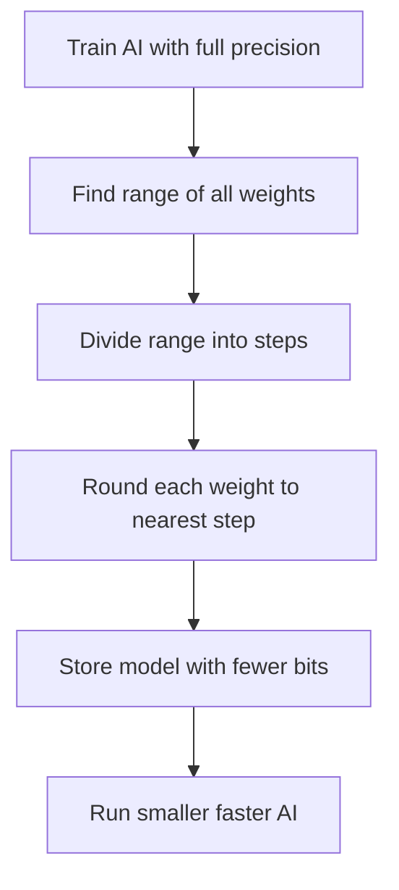

## 🤔 What Is It?

> **quantization in AI**

Quantization is how AI models shrink their size by rounding their internal numbers to simpler values, so they run faster and fit on smaller devices with almost no loss in quality.

## 🧩 Like swapping a 16-million-crayon box for a 256-crayon box

Imagine an AI artist who learned to draw using a box with 16 million different crayons — one for every possible shade of every color. Each drawing is incredibly detailed and precise, but carrying that enormous box everywhere is exhausting and it takes ages just to pick the right crayon. Quantization is like giving that same artist a box of just 256 crayons and saying, 'For each color you need, just pick the closest one you have.' The artist can still draw almost everything recognizably — the sky still looks blue, grass still looks green — and now the box is tiny enough to fit in a backpack. Almost no one looking at the finished drawing can spot the difference, and the artist draws much, much faster.

## ⚙️ How It Works

1. **Train with the full crayon box** — First, the AI is trained the normal way using full-precision numbers — like having all 16 million crayons available so it learns the most accurate version of every detail.
2. **Check the range of colors used** — The computer looks at every weight in the model to find the smallest and largest values — like scanning the drawing to see which colors were actually used, from lightest to darkest.
3. **Divide the range into steps** — That full range of values is split into a small number of evenly spaced steps — like laying out just 256 crayons across the same color spectrum instead of 16 million.
4. **Round each weight to the nearest step** — Every single weight gets rounded to whichever step is closest — just like the artist picks the nearest available crayon when the exact shade isn't in the smaller box.
5. **Store and run the shrunken model** — Now each weight needs only a few bits of storage instead of many, so the whole model is much smaller and faster to run — the artist carries a light backpack instead of a truck full of crayons.

## 🗺️ Picture It

## 🔑 Key Words

- **weights** — the millions of numbers inside an AI model that store everything it learned during training
- **precision** — how many bits are used to store each number — more bits means more possible values and finer detail
- **float32** — a format that uses 32 bits per number, giving about 4 billion possible values — the '16-million-crayon box'
- **INT8** — a format that uses only 8 bits per number, giving 256 possible values — the '256-crayon box'
- **quantization** — the process of converting an AI model's numbers from high precision to lower precision to save space and speed it up

## 🌍 Why It Matters

Without quantization, powerful AI models would only run on huge, expensive servers because they need too much memory and computing power. Quantization makes it possible for AI to run directly on phones, tablets, and laptops — even offline — so apps like Google Translate or voice assistants can respond instantly without sending your data to a faraway computer. It also means AI uses less battery, which matters a lot for everyday devices.

## 🔍 Where You'll See This

- Google Translate working offline on your phone to translate text without any internet connection
- Siri or Google Assistant responding instantly on your device without waiting for a distant server
- AI opponents in mobile games making smart moves without needing a powerful gaming console
- Snapchat's real-time face filters running smoothly using a tiny on-device AI

## ✅ Check Yourself

**Q1.** The numbers inside a neural network that store everything it learned during training are called ____.

- weights
- precision
- float32

Show answer

<strong>weights</strong> — 'Weights' are the learned values stored inside the model; precision describes how detailed each number is, and float32 is a storage format, not the name for what is stored.

**Q2.** Switching from float32 to ____ cuts the storage for each number from 32 bits down to just 8 bits.

- INT8
- weights
- quantization

Show answer

<strong>INT8</strong> — INT8 is the 8-bit integer format that replaces float32; weights are what gets stored rather than a storage format, and quantization is the overall process, not a specific format.

**Q3.** When every number in a model is rounded to a simpler value that takes less space, we are reducing its ____.

- precision
- float32
- INT8

Show answer

<strong>precision</strong> — Precision is the property that describes how many distinct values a number can have; float32 and INT8 are specific formats, not the property being reduced.

**Q4.** The entire process of shrinking an AI model's numbers so it runs faster on smaller devices is called ____.

- quantization
- weights
- INT8

Show answer

<strong>quantization</strong> — Quantization names the whole conversion process; weights are what gets changed by it, and INT8 is one of the output formats that process can produce.

## 🎉 Fun Fact

> A quantized AI model can be up to 4 times smaller than the original — so a model that used to need 20 gigabytes of storage (enough for about 5,000 songs!) can shrink to just 5 gigabytes, small enough to live entirely on your phone.
