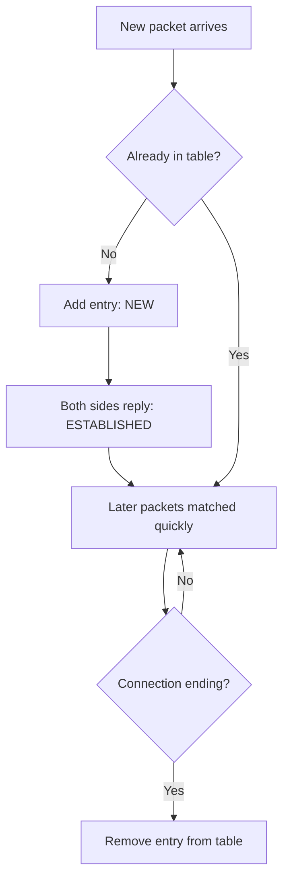

## 🤔 What Is It?

> **conntrack**

Conntrack is a running list your computer keeps of every network conversation currently happening, so it instantly knows whether an incoming message is a trusted reply from someone you are already chatting with or a stranger trying to barge in for the first time.

## 🧩 Like a school's visitor sign-in desk

Imagine your school has a strict sign-in desk at the front door. When a visitor arrives for the very first time, the receptionist writes their name and destination in the visitor log and hands them a badge. Now, every time that visitor walks through a different doorway inside the school, teachers do not have to quiz them from scratch — they just check for the badge and wave them through. When the visitor is done and leaves, the receptionist crosses them off the log to free up space. Your computer does exactly the same thing: the first time a website tries to talk to you, conntrack creates a fresh log entry; every later message in that same conversation is recognized by the badge (the entry in the log) and flows through quickly; and when the conversation ends, the entry is erased.

## ⚙️ How It Works

1. **New visitor arrives at the door** — A packet shows up trying to start a brand-new connection. Conntrack checks its visitor log — the connection table — finds no entry, and knows this is a stranger knocking for the first time.
2. **Receptionist writes a log entry** — Conntrack adds a fresh record to its connection table, noting who is talking to whom, which port number (like a room number in the school), and which protocol they are using. This entry is stamped with the state NEW.
3. **Both sides respond — badge issued** — Once the other computer replies and a real back-and-forth begins, conntrack upgrades the entry's label to ESTABLISHED — like handing the visitor an official badge that proves they are expected, checked-in, and trusted.
4. **Later packets glide through freely** — Every following packet in the same conversation is matched against the connection table in microseconds. Spotting the badge means no long interrogation — the packet is waved through almost instantly, just like a teacher glancing at a visitor's badge in the hallway.
5. **Visitor signs out — entry removed** — When either side signals the conversation is over, or it goes quiet for too long, conntrack removes the entry from its table — exactly like the receptionist crossing a departed visitor off the log to keep things tidy.

## 🗺️ Picture It

## 🔑 Key Words

- **conntrack** — The Linux kernel feature that tracks every active network connection so a firewall can make smarter, faster decisions
- **packet** — A small, labeled chunk of data sent across a network — like a tiny envelope carrying one piece of a longer message
- **stateful** — Able to remember the history of a connection, rather than treating every packet as a complete stranger with no context
- **connection table** — The visitor log conntrack maintains listing every active network conversation, who is involved, and what state it is in
- **ESTABLISHED** — The label conntrack gives a connection once both sides have successfully communicated — meaning it is a trusted, ongoing conversation
- **NAT** — Network Address Translation — a trick that lets many devices, like all the phones in your home, share one single public internet address

## 🌍 Why It Matters

Without conntrack, your firewall would have to write a separate permission rule for every possible reply from every website — an impossible task. Conntrack makes stateful firewalls practical, which is why every home router and every cloud server uses it to block attackers while letting your streaming videos and game sessions flow without interruption. It also powers NAT, which is how an entire household of phones, tablets, and laptops can all share one internet address.

## 🔍 Where You'll See This

- Your home Wi-Fi router letting Netflix reply packets reach your TV without you needing to set up special rules for return traffic
- An online game server recognizing your ongoing match session and not treating each in-game update as a suspicious new stranger
- Your school's firewall letting a website you started loading finish sending its pages, while still blocking random outside computers that try to connect without being invited

## ✅ Check Yourself

**Q1.** A firewall that uses ____ can remember whether traffic belongs to an ongoing conversation or is a brand-new, unknown request.

- stateful
- packet
- NAT

Show answer

<strong>stateful</strong> — Stateful means the firewall tracks connection history; packet names a data chunk and NAT names an address-sharing trick — neither describes memory of past decisions.

**Q2.** Once your computer and a web server have successfully exchanged messages back and forth, conntrack marks the connection as ____.

- ESTABLISHED
- NAT
- conntrack

Show answer

<strong>ESTABLISHED</strong> — ESTABLISHED is the specific state label applied once both sides have replied; NAT and conntrack name a technique and a system, not a connection state.

**Q3.** Each tiny envelope of data sent across the internet is called a ____.

- packet
- connection table
- ESTABLISHED

Show answer

<strong>packet</strong> — A packet is the small, labeled chunk of data; connection table is the visitor log of conversations, and ESTABLISHED is a state label — neither is a unit of data.

**Q4.** Conntrack records every active conversation in something called a ____.

- connection table
- NAT
- packet

Show answer

<strong>connection table</strong> — The connection table is conntrack's visitor log of all ongoing sessions; NAT is an address-sharing technique and packet is a data unit, not a storage structure.

**Q5.** Your home router uses ____ so that your phone, tablet, and laptop can all share a single internet address.

- NAT
- conntrack
- ESTABLISHED

Show answer

<strong>NAT</strong> — NAT (Network Address Translation) is the specific technique for sharing one public address; conntrack tracks connections and ESTABLISHED is a state label, neither shares addresses.

## 🎉 Fun Fact

> A busy web server handling millions of visitors might have over one million entries in its connection table at the same moment — and conntrack can look up any single one of them in less time than it takes you to blink!
