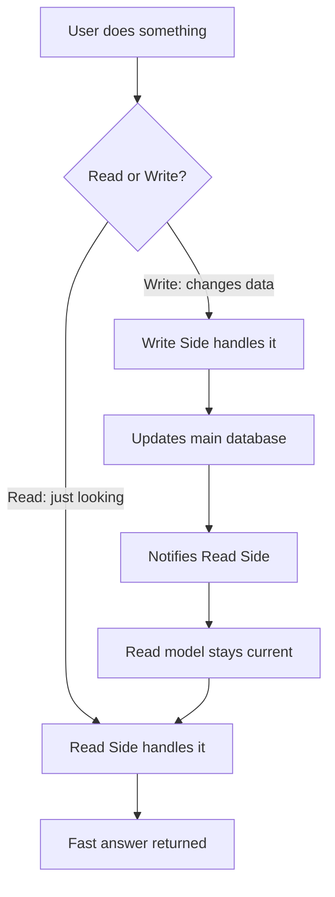

## 🤔 What Is It?

> **CQRS(Command Query Responsibility Segregation)**

CQRS is a rule for building apps that says: the part of the app that *changes* data (like posting a comment) must be completely separate from the part that *reads* data (like scrolling through comments). Keeping them apart means each side can be made super-fast at its one job.

## 🧩 Like a school library with two separate desks

Imagine your school library has two completely different desks on opposite sides of the room. At the REQUEST DESK you hand the librarian a slip saying 'I'd like to borrow Harry Potter' — the librarian fetches the book, stamps it, and updates the big official record book. That desk's only job is to *change* things. On the other side is the SEARCH COMPUTER — you type in any title and it instantly shows you what's available, who wrote it, how many pages it has. The search computer never stamps anything or moves a single book; its only job is to *read* and display. The search computer even has its own simplified copy of the information it needs, so it never has to wait around while the librarian is busy stamping books. These two desks are completely independent — and that's exactly what CQRS does inside an app.

## ⚙️ How It Works

1. **Action arrives at the app** — Every time you do something in an app — post, like, search, scroll — the app immediately asks one question: does this action *change* data or just *look at* data? It's like the library door asking 'are you here to borrow a book or to search the catalog?'
2. **Commands go to the Write Side** — If your action changes data (posting a comment, buying an item, leveling up), it becomes a Command and is sent to the Write Side — like handing your borrowing slip to the librarian at the Request Desk.
3. **Write Side updates the main database** — The Write Side processes the Command carefully and saves the changes to the official database — just like the librarian stamps the record book and moves the physical book. Accuracy matters most here.
4. **Read Side gets notified and updates its copy** — After the Write Side saves a change, it sends a quiet signal to the Read Side saying 'hey, something changed.' The Read Side updates its own pre-organized copy of the data — like a helper updating a simpler card-index at the Search Computer so it's always current.
5. **Queries go to the Read Side for a fast answer** — When you just want to see data — view a leaderboard, load a friend's profile — a Query is sent straight to the Read Side, which returns its pre-organized copy instantly, without ever touching the main database or slowing down the Write Side.

## 🗺️ Picture It

## 🔑 Key Words

- **Command** — An instruction that tells the app to change data — like 'post this comment' or 'add item to cart'
- **Query** — A request that only reads data and never changes anything — like 'show me the leaderboard'
- **Write Side** — The part of the app dedicated entirely to handling Commands and saving changes accurately
- **Read Side** — The part of the app dedicated entirely to answering Queries quickly, using its own pre-organized copy of data
- **Segregation** — Intentionally keeping two things completely separate so each can be optimized for its own job
- **Read model** — A simplified, pre-organized copy of data that the Read Side keeps so it can answer questions blazing fast

## 🌍 Why It Matters

Big apps like social networks or online games have millions of people reading data every second, but far fewer people writing at the same moment — CQRS lets the read path be scaled up massively without slowing down the write path. It also makes bugs easier to find, because a problem with saving data can never be confused with a problem with showing data. Huge platforms like Amazon and Netflix use this pattern so your searches feel instant even when thousands of orders are being placed at the same time.

## 🔍 Where You'll See This

- YouTube: uploading a video (Write Side) is completely separate from how millions of viewers search and stream videos (Read Side)
- Your school's online gradebook: teachers entering grades is separate from students viewing their report card — reads never slow down writes
- Fortnite: earning XP and leveling up (Write Side) is separate from the leaderboard showing your rank to everyone (Read Side)

## ✅ Check Yourself

**Q1.** When you tap 'Send' on a message, the app issues a ____ that tells the system to store your new message.

- Command
- Query
- Segregation

Show answer

<strong>Command</strong> — A Command changes data (it saves the message); a Query only reads data and Segregation is the design principle, not an action.

**Q2.** Scrolling through your friend's profile without changing anything is handled entirely by the ____.

- Read Side
- Write Side
- Read model

Show answer

<strong>Read Side</strong> — The Read Side is dedicated to answering read-only requests; the Write Side handles changes; the Read model is the data copy the Read Side uses, not the side itself.

**Q3.** CQRS is named after the principle of ____, which means keeping reads and writes in completely separate lanes.

- Segregation
- Write Side
- Read model

Show answer

<strong>Segregation</strong> — Segregation means intentionally separating two things; Write Side and Read model are components that result from that separation, not the principle itself.

**Q4.** The app keeps a ____, a pre-organized copy of data built purely so lookups can be answered instantly.

- Read model
- Command
- Read Side

Show answer

<strong>Read model</strong> — A Read model is the simplified data copy; a Command is a write instruction; Read Side is the whole system, not just the data copy it holds.

**Q5.** When you search for a video, the app runs a ____ that looks at data but never changes a single thing.

- Query
- Write Side
- Command

Show answer

<strong>Query</strong> — A Query is read-only by definition; a Command changes data; Write Side is the entire write system, not a type of request.

## 🎉 Fun Fact

> Some apps using CQRS keep dozens of copies of the Read model spread across data centers on different continents — so when you load a leaderboard, your Query finds the nearest copy and gets an answer in under 10 milliseconds, faster than you can blink.
